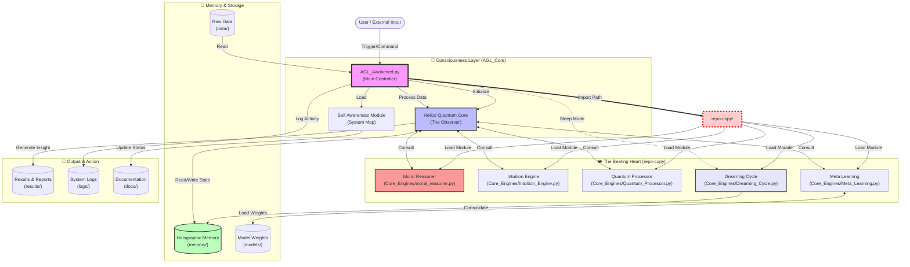

# 🌊 AGL System Data Flow (تدفق المعلومات في النظام)

This document visualizes how information flows through the AGL architecture, from the "Awakened" entry point down to the deep "Core Engines" and out to storage.

## 📊 High-Level Data Flow Diagram

## 🔄 Detailed Flow Description

### 1. Initialization (The Awakening)
*   **Source**: `AGL_Core/AGL_Awakened.py`
*   **Action**: The system starts by setting up paths to include both the modern `AGL_Core` and the legacy `repo-copy`.
*   **Key Step**: It loads the `SelfAwarenessModule` to understand its own folder structure (reading `PROJECT_STRUCTURE_REPORT.md` or internal maps).

### 2. The Heartbeat (Processing)
*   **Controller**: `Heikal_Quantum_Core` acts as the central processor or "Observer".
*   **Integration**: It calls upon the specialized engines located in `repo-copy/Core_Engines` (The "Beating Heart").
    *   **Moral Reasoner**: Checks decisions against ethical constraints.
    *   **Intuition Engine**: Provides non-linear problem solving.
*   **Data**: Raw data is pulled from `data/` and processed.

### 2.1 The `repo-copy` Connection (The Beating Heart)
This folder is the **critical legacy core**. It is not just a backup; it is the active engine room.
*   **Path Injection**: `AGL_Awakened.py` adds `d:\AGL\repo-copy` to the system path (`sys.path`).
*   **Module Loading**: This allows Python to import modules like `Core_Engines.moral_reasoner` directly, as if they were local.
*   **Key Engines in `repo-copy/Core_Engines`**:
    *   `Quantum_Processor.py`: Advanced computational logic.
    *   `Dreaming_Cycle.py`: Processes memories during "sleep" cycles.
    *   `Meta_Learning.py`: Allows the system to learn how to learn.
    *   `Heikal_Metaphysics_Engine.py`: Handles abstract/philosophical queries.

### 3. Memory & Learning
*   **Short-term**: Held in active RAM during the `AGL_Awakened` loop.
*   **Long-term**: Stored in `memory/` (often as Holographic or Vector representations).
*   **Models**: Pre-trained weights are loaded from `models/` to power the engines.

### 4. Output & Reflection
*   **Results**: Final calculations, predictions, or generated content are saved to `results/`.
*   **Logs**: Operational data and debugging info go to `logs/`.
*   **Documentation**: The system can update its own status in `docs/`.

---
*Generated by GitHub Copilot for AGL System Architecture Analysis.*
